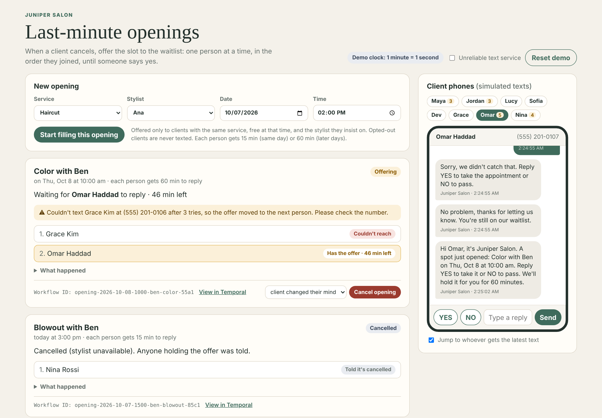

# Juniper Salon: filling last-minute openings

A working prototype for Lena, owner of Juniper Salon. When a client cancels at
short notice, staff add the opening once, and the app offers it to the waitlist
**one client at a time, in the order they joined**, until someone says yes. It
is built on [Temporal](https://temporal.io/), so each opening keeps going
reliably. It waits for replies, moves on by itself, retries texts that fail,
and picks up where it left off after a restart.



## Run it (one command)

Requirements: Node.js 20 or newer, and Docker Desktop running (or the
[Temporal CLI](https://docs.temporal.io/cli) installed instead of Docker).

```bash
npm start
```

This installs dependencies, starts the local Temporal service, the Worker and
the web app. Then open:

- App: <http://localhost:3000>
- Temporal Web UI: <http://localhost:8233>

Stop with `Ctrl+C`. If Temporal was started with Docker, `npm run stop` shuts
the container down. `npm run dev` does the same as `npm start` without
reinstalling.

## Try it in three minutes

The demo clock runs fast: **1 minute = 1 second**, so the 15-minute hold Lena
asked for takes 15 seconds. The waitlist is sample data with made-up names.

1. **Fill a same-day haircut.** The form is pre-filled with a haircut with Ana
   today at 2:00 pm. Click **Start filling this opening**. Maya gets the first
   text because she joined the waitlist first. Lucy also fits but opted out of
   texts, so she is never contacted.
2. **Let Maya's offer run out.** Don't reply as Maya. After 15 seconds the offer
   moves to Jordan by itself.
3. **Reply as the clients.** In **Client phones**, open Maya and tap **YES**. She
   is told politely that the opening is gone and she's still on the waitlist.
   Then open Jordan and tap **YES**. Jordan is booked and gets a confirmation,
   and the front desk gets "Please add it to Square".
4. **See what happens when things go wrong.** Create **Color with Priya**.
   - Grace's number can't receive texts (a demo setting). Temporal retries her
     text 3 times, then skips her and tells staff to check the number.
   - Omar gets the offer next. Reply `maybe later?`. Omar is asked to answer YES
     or NO, and staff see **Mark YES / Mark NO** buttons.
5. **Cancel.** Create **Blowout with Ben**, choose "stylist unavailable" and
   click **Cancel opening**. Nina, who held the offer, is told.
6. **Restart mid-offer.** Start any opening and press `Ctrl+C` while someone
   holds the offer. Run `npm start` again. The opening continues from the same
   point and the countdown hasn't reset. While the Worker is down, the board
   shows **Paused: worker offline** instead of going quiet.
7. **Make the text service unreliable.** Tick **Unreliable text service**. Every
   text now fails twice before it goes through. Nothing is lost, only slower,
   and you can watch the retries in the Temporal Web UI.
8. Click **View in Temporal** on any opening to see its full history.

**Reset demo** stops any running openings and restores the sample waitlist.

## What Lena said, and where it is

The full notes, with her exact words, are in
[`docs/discovery-notes.md`](docs/discovery-notes.md).

| What Lena said | Where it is in the prototype |
|---|---|
| "They need to match the service and time, plus any required stylist preference. If several fit, we go by who joined the waitlist earliest." | `findMatchingClients` in `src/activities.ts`: same service, free at that time, the stylist they insist on, sorted by join date |
| "one at a time in waitlist order feels fairer and avoids competing acceptances" | The loop in `fillOpeningWorkflow`: exactly one client holds the offer at a time |
| "For a same-day opening, give them 15 minutes, then move on if they haven't answered." | A durable 15-minute hold (60 minutes for later dates, our assumption) and an automatic move to the next person |
| "two clients expected the same Saturday haircut after both replied yes to a group text" | Replies go through a Temporal Update, handled one at a time inside the workflow. Only the person who holds the offer can accept, so a slot can never be given twice |
| "We have to tell them it's gone, which is awkward." | A late YES gets an automatic, polite "no longer available, you're still on the waitlist" text |
| "who currently has the offer, who already declined or timed out, and who is still available. Also whether the opening was filled or cancelled." | The staff board shows each opening's queue with live states and time left, plus Filled, Unfilled, Cancelled or Paused |
| "They need the service, stylist, date, and time, and a clear way to accept or decline." | The offer text includes all four, plus "Reply YES to take it or NO to pass" |
| "The client and front desk should be notified when it's filled, and we need to tell other people the opening is no longer available." | Confirmation text, a front desk note ("Please add it to Square"), and an update text to anyone whose offer timed out |
| "We should be able to create the opening, see its status, and cancel it… We don't want to approve every step manually." | Create, watch and cancel from the board. Everything in between runs on its own |
| "If everyone passes, mark the opening unfilled and let us know." | Phase **Unfilled** plus a front desk note |
| "an opening quietly stalling or a message not reaching someone. Replies can also be unclear" | Failed texts are retried, then skipped and flagged. Unclear replies are flagged with one-click Mark YES / Mark NO. A Worker outage shows as **Paused** and resumes by itself |
| "Some clients may opt out of texts, and that needs to be respected." | Opted-out clients are never texted, and a reply of STOP opts a client out |
| "We don't need this to update Square" / "clients shouldn't need to create accounts" / "simple and calm on a phone" | No Square integration, no client accounts (they just reply to texts), short friendly messages, and a layout that works on a phone |

## How Temporal is used

| Temporal feature | What it does for Lena | Code |
|---|---|---|
| **Workflow**, one per opening | The whole "fill this slot" process is one durable run with a readable ID such as `opening-2026-10-07-1400-ana-haircut-17d2` | `fillOpeningWorkflow` in `src/workflows.ts` |
| **Durable timer** (`condition` with a timeout) | The 15- or 60-minute hold survives crashes and restarts. The countdown never resets or gets forgotten | `src/workflows.ts` |
| **Update** `clientReply` | Each reply is processed in order inside the workflow and answered straight away (`accepted`, `declined`, `too_late`, `unclear`, `opted_out` or `already_booked`). This is what prevents double booking | `src/workflows.ts`, `/api/replies` in `src/api.ts` |
| **Signal** `cancelOpening` | Staff cancel at any time, and whoever holds the offer is told | `src/workflows.ts` |
| **Query** `getOpeningStatus` | The live board: who has the offer, time left, history, items that need attention | `src/workflows.ts`, `/api/state` |
| **Activities with retry policies** | Texts are retried (3 attempts, then the client is skipped and staff are flagged). Waitlist and front desk updates retry until they succeed | `src/activities.ts`, `proxyActivities` in `src/workflows.ts` |
| **Workers and task queues** | If the Worker stops, Temporal keeps every opening's state. The board shows **Paused**, and work resumes when the Worker is back | `src/worker.ts` |

Evidence of one complete run in the Temporal Web UI:
[`evidence/temporal-web-ui.png`](evidence/temporal-web-ui.png). It shows the
workflow ID, the Completed status, and the event history: find matches → text
Maya → 15-minute timer fires → text Jordan → Maya's late reply (`too_late`) →
Jordan's reply (`accepted`) → booking, confirmation and front desk note.

## Simulated or left out

- **Texts are simulated.** They appear in the on-screen client phones and in
  `data/messages.jsonl`. No texting provider is connected. `sendText` is the one
  place to plug one in.
- **The waitlist is sample data** with made-up names and 555 numbers, stored in
  `data/waitlist.json`, not Lena's Google Sheet.
- **No Square connection**, by Lena's choice. Staff keep Square as the real
  calendar, and the front desk note reminds them to add the booking.
- **Demo clock.** One minute lasts one second. Set `MINUTE_MS=60000` for real
  time.
- **Not built yet:** staff logins, deploying beyond one computer, a quiet-hours
  rule (Lena has "no formal rule" yet), and clients joining the waitlist from the
  app.
- **Assumptions she left open:** a 60-minute hold for openings that aren't
  same-day, and what happens to unclear replies. Both are listed in
  `docs/discovery-notes.md`.

## Tests

```bash
npm test          # 11 workflow tests on Temporal's time-skipping test server (no Docker needed)
npm run typecheck # TypeScript
```

The tests cover:
- the first yes winning
- the offer moving on after 15 minutes and a late yes being turned away
- everyone passing, so the opening is unfilled
- a staff cancel
- a text that can't be delivered
- an unclear reply being settled by staff
- STOP
- two regression cases for repeat replies from the client who booked

## Settings

| Variable | Default | Meaning |
|---|---|---|
| `MINUTE_MS` | `1000` | Length of one "minute" (60000 = real time) |
| `SAME_DAY_HOLD_MINUTES` | `15` | Hold time for a same-day opening (Lena's rule) |
| `LATER_HOLD_MINUTES` | `60` | Hold time for later dates (our assumption) |
| `PORT` | `3000` | Web app port |
| `TEMPORAL_ADDRESS` | `localhost:7233` | Temporal service |
| `DATA_DIR` | `./data` | Where the sample waitlist and simulated texts live |

## Repository map

- `src/workflows.ts`: the opening Workflow and its Update, Signal and Query
- `src/activities.ts`: matching, texting, booking, front desk notes, opt-outs
- `src/worker.ts`: the Worker on the `juniper-waitlist` task queue
- `src/api.ts`: the browser-facing API and Temporal Client
- `src/store.ts`, `src/seed.ts`: a JSON-file stand-in for the sheet and phone, and the sample waitlist
- `public/`: the staff board and simulated client phones
- `tests/workflow.test.ts`: workflow tests
- `docs/discovery-notes.md`: what Lena told us, with assumptions
- `presentation/juniper-salon-slides.pdf`: 5 slides for Lena (built by `presentation/build-deck.mjs`)
- `evidence/temporal-web-ui.png`: Temporal Web UI screenshot
- `scripts/dev.mjs`: the one-command launcher

Started from the Temporal post-assessment starter; this repository is not a fork.
